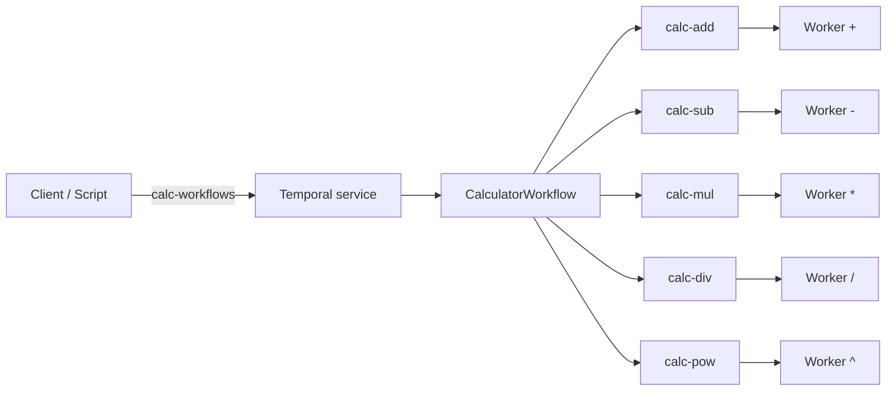

# Temporal Worker SDK and Calculator on Kubernetes

Reusable **Temporal worker SDK** for Python (`temporal_worker_sdk`) plus a reference **distributed calculator** (`calculator`): one workflow task queue and five operator queues so each binary operation runs on a dedicated worker. The repo includes **Kubernetes manifests**, deploy scripts, a workflow trigger script, and optional **horizontal pod autoscaling** (HPA) on CPU for the add worker.

**Documentation map**

| Topic | Where |
|--------|--------|
| Locked MVP decisions (queues, timeouts, rounding, logging) | [specs/requirements/requirements-decisions.md](specs/requirements/requirements-decisions.md) |
| Architecture, task queues, tradeoffs, pre-deploy guardrails | [specs/requirements/requirements-architecture.md](specs/requirements/requirements-architecture.md) |
| Post-MVP / production backlog | [FUTURE.md](FUTURE.md) |
| LLM assistance (prompts, iterations, how to reduce) | [specs/requirements/requirements-llm-disclosure.md](specs/requirements/requirements-llm-disclosure.md) and [AI usage](#ai-usage) below |

## Prerequisites

- Python **3.11+**
- [Poetry](https://python-poetry.org/docs/#installation)
- For Kubernetes on **minikube**: a container runtime, `kubectl`, and [minikube](https://minikube.sigs.k8s.io/docs/start/) (see [Local Kubernetes](#local-kubernetes-minikube))

## Quick start

**Python SDK only (no cluster)**

```bash
poetry install
poetry run pytest -m "not integration"
```

**End-to-end on minikube**

1. Create the Postgres secret (see [PostgreSQL Secret](#postgresql-secret-no-cleartext-in-git)).
2. Build and load the worker image: `docker build -t calculator-worker:0.1.0 .` then `minikube image load calculator-worker:0.1.0`.
3. Deploy: `./scripts/deploy.sh` (Unix) or `.\scripts\deploy.ps1` (PowerShell).
4. Port-forward Temporal: `kubectl port-forward -n temporal svc/temporal 127.0.0.1:7233:7233`, then `poetry run python scripts/trigger_calculator_workflow.py`.

Optional HPA: `./scripts/deploy.sh --with-hpa` or `.\scripts\deploy.ps1 -ApplyHpa` (requires metrics-server). Details: [Autoscaling (bonus)](#autoscaling-bonus).

## Deliverables (assignment alignment)

| Deliverable | Where / how |
|-------------|-------------|
| **Source code** | `src/temporal_worker_sdk/`, `src/calculator/`, `tests/`, `k8s/`, `scripts/` |
| **How to run** | This README: [Install](#install), [Worker environment variables](#worker-environment-variables), [Local Kubernetes](#local-kubernetes-minikube), [Trigger a complex workflow](#trigger-a-complex-workflow-host-python) |
| **Design (architecture + tradeoffs)** | [Design (topology)](#design-topology), [Calculator API](#calculator-api-workflow--activities), and [requirements-architecture.md](specs/requirements/requirements-architecture.md) |
| **LLM use** (if applicable) | [AI usage](#ai-usage) and [requirements-llm-disclosure.md](specs/requirements/requirements-llm-disclosure.md) |

**What reviewers typically look for** — solid engineering (tests, typing, no secrets in Git), clear system design (queues, probes, shutdown), and explanations that stand alone without reading every spec line-by-line.

| # | Assignment topic | Where in this README |
|---|------------------|----------------------|
| 1 | Worker SDK (env-based bootstrap, reusable for other teams) | [Public API](#public-api-integration-surface), [Worker environment variables](#worker-environment-variables) |
| 2 | Calculator workflow (expression string, precedence, one queue per operator type) | [Calculator API](#calculator-api-workflow--activities), [Design (topology)](#design-topology) |
| 3 | SDK upgrades: graceful shutdown, logs + metrics, probes without changing worker app code | [Graceful shutdown](#graceful-shutdown-sigterm--sigint), [Structured logging](#structured-logging), [Prometheus metrics](#prometheus-metrics-low-cardinality), [Health probes](#health-probes), [Public API](#public-api-integration-surface) (`TEMPORAL_WORKER_HEALTH_ADDR`) |
| 4 | Kubernetes: manifests, deploy script, complex trigger script | [Local Kubernetes](#local-kubernetes-minikube), [Deploy](#deploy-scripts), [Trigger a complex workflow](#trigger-a-complex-workflow-host-python) |
| 5 | Bonus: HPA, stress test, which metric / why / limitations | [Autoscaling (bonus)](#autoscaling-bonus) |

## Install

```bash
poetry install
```

## Worker environment variables

Environment names and defaults match the locked MVP document [requirements-decisions.md](specs/requirements/requirements-decisions.md). The worker reads **Temporal** settings as `TEMPORAL_ADDRESS`, `TEMPORAL_NAMESPACE`, and `TEMPORAL_TASK_QUEUE` (not only manifest ConfigMap keys).

### Required (fail fast if missing or blank)

| Variable | Purpose |
|----------|---------|
| `TEMPORAL_ADDRESS` | gRPC target for the Temporal frontend (port **7233** in the bundled stack). |
| `TEMPORAL_NAMESPACE` | Temporal namespace for this worker. |
| `TEMPORAL_TASK_QUEUE` | Task queue this worker polls (`calc-workflows`, `calc-add`, `calc-sub`, `calc-mul`, `calc-div`, `calc-pow` for the reference calculator). |

### Optional

| Variable | Default | Purpose |
|----------|---------|---------|
| `WORKER_ROLE` | unset | Reference image roles: `workflow`, `add`, `sub`, `mul`, `div`, `pow`. Optional for generic SDK consumers. |
| `TEMPORAL_IDENTITY` | unset | Worker identity passed to the Temporal client when set. |
| `LOG_JSON` | off | When truthy, JSON logs to stdout. |
| `TEMPORAL_WORKER_HEALTH_ADDR` | unset | When set (e.g. `0.0.0.0:8080`), serves `/livez`, `/readyz`, `/metrics`. Unset = no HTTP server (backward compatible). |
| `TEMPORAL_WORKER_GRACEFUL_SHUTDOWN_TIMEOUT_SEC` | `30` | Temporal `Worker` graceful shutdown window for in-flight activities. |
| `TEMPORAL_WORKER_SHUTDOWN_MAX_WAIT_SEC` | `120` | Upper bound waiting on `worker.shutdown()` after SIGINT/SIGTERM; exit **124** if exceeded. |
| `TEMPORAL_WORKER_LOG_PAYLOADS_DEBUG` | off | When truthy, DEBUG may log truncated workflow/activity argument previews. INFO does not log full raw payloads. |

### Graceful shutdown (SIGTERM / SIGINT)

- The SDK registers **SIGINT** and **SIGTERM** (where supported) and calls Temporal’s `worker.shutdown()` so polling stops and activities drain per `TEMPORAL_WORKER_GRACEFUL_SHUTDOWN_TIMEOUT_SEC`.
- Kubernetes sends **SIGTERM** on pod termination; size `terminationGracePeriodSeconds` with the graceful timeout plus buffer.
- On **Windows**, signal handling may differ; **Ctrl+C** is the reliable local stop. Confirm SIGTERM behavior with your platform team in production.

### Structured logging

- **Text (default):** lines include `queue=` and `namespace=`; activity/workflow logs add `workflow_id`, `workflow_run_id`, and type names when available.
- **JSON (`LOG_JSON`):** one object per line with `ts`, `level`, `logger`, `message`, and the same correlation fields.
- Do not put secrets in workflow/activity inputs.

### Prometheus metrics (low cardinality)

Exposed only when **`TEMPORAL_WORKER_HEALTH_ADDR`** is set, on **`/metrics`**. Labels are limited to **`activity`** name and fixed **`outcome`** values — not workflow or run ids.

| Metric | Type | Labels | Meaning |
|--------|------|--------|---------|
| `temporal_worker_activity_starts_total` | Counter | `activity` | Activity tasks started |
| `temporal_worker_activity_completions_total` | Counter | `activity`, `outcome` (`success` / `failure` / `cancelled`) | Terminal outcomes |
| `temporal_worker_activity_execution_seconds` | Histogram | `activity` | Wall time in the activity callable |
| `temporal_worker_activity_schedule_to_start_seconds` | Histogram | `activity` | Scheduled to execute start (queue/poll proxy) |

Histogram buckets are fixed in [`src/temporal_worker_sdk/metrics.py`](src/temporal_worker_sdk/metrics.py): `ACTIVITY_EXECUTION_BUCKETS`, `ACTIVITY_SCHEDULE_TO_START_BUCKETS`.

### Health probes

When **`TEMPORAL_WORKER_HEALTH_ADDR`** is set:

| Path | Purpose |
|------|---------|
| `/livez` | **Liveness** — process is serving (200 while the HTTP server is up). |
| `/readyz` | **Readiness** — 200 after the worker has started polling; **503** before that or while draining after shutdown. |
| `/metrics` | Prometheus scrape endpoint. |

**Kubernetes example** (same port as the bind address):

```yaml
env:
  - name: TEMPORAL_WORKER_HEALTH_ADDR
    value: "0.0.0.0:8080"
ports:
  - containerPort: 8080
    name: probes
livenessProbe:
  httpGet:
    path: /livez
    port: probes
  initialDelaySeconds: 5
  periodSeconds: 10
readinessProbe:
  httpGet:
    path: /readyz
    port: probes
  initialDelaySeconds: 5
  periodSeconds: 5
```

Configure Prometheus to scrape `http://<pod-ip>:8080/metrics` (or your operator’s equivalent).

## Public API (integration surface)

Import from the package root:

- **`run_worker`** — blocking entry: env config, connect, poll with given workflows/activities.
- **`run_worker_async`** — same for async callers.
- **`load_worker_config`** / **`WorkerConfig`** / **`ConfigError`** — typed env loading.

Example: [examples/minimal_worker.py](examples/minimal_worker.py)

```bash
set TEMPORAL_ADDRESS=127.0.0.1:7233
set TEMPORAL_NAMESPACE=default
set TEMPORAL_TASK_QUEUE=calc-workflows
poetry run python examples/minimal_worker.py
```

(On Unix, use `export` instead of `set`.)

**Probes without app code changes:** set `TEMPORAL_WORKER_HEALTH_ADDR` only; existing workers pick up `/livez`, `/readyz`, and `/metrics` from the SDK.

## Calculator API (workflow + activities)

**Contract** (names, queues, limits, errors): [specs/features/api-workflow-activity-contracts.md](specs/features/api-workflow-activity-contracts.md). Constants: `calculator.contracts`; errors and limits: `calculator.errors`, `calculator.limits`.

The expression is **parsed inside the workflow** (deterministic). Rationale: [docs/adr/0001-parse-in-workflow.md](docs/adr/0001-parse-in-workflow.md).

**Workflow:** `CalculatorWorkflow` on **`calc-workflows`**. **Input:** expression string. **Output:** result string. Numbers use **`decimal.Decimal`** on the wire as **strings**; the workflow **quantizes once** at the end to two decimal places with **ROUND_UP** (see decisions doc). **Precedence:** `^` > `* /` > `+ -`; **left-associative** at each level (e.g. `2^3^2` → 64). **Limits:** stripped length and max binary operators are enforced (see `calculator.limits` and the decisions doc).

**Per-operator activities** (each binary op on its own queue):

| Operator | Activity | Task queue |
|----------|----------|------------|
| `+` | `add` | `calc-add` |
| `-` | `subtract` | `calc-sub` |
| `*` | `multiply` | `calc-mul` |
| `/` | `divide` | `calc-div` |
| `^` | `power` | `calc-pow` |

**Timeouts and retries (reference calculator)**

| Scope | Default | Notes |
|-------|---------|--------|
| Activity start-to-close | **60s** | All five operator activities. |
| Workflow run (starter) | **15 minutes** suggested | Set on client start; cost scales with binary operator count. |
| Activity retries | Up to **5** attempts, 1s initial, ×2, 30s max | Domain errors (`non_retryable`) are not retried. |

Use **`WORKFLOW_NAME`**, **`WORKFLOW_TASK_QUEUE`**, and **`activity_and_queue_for_binary_operator`** from `calculator.contracts` so names stay aligned. **Versioning:** see the API contract doc and [CHANGELOG.md](CHANGELOG.md).

## Design (topology)

Six workers: one for the workflow queue, one per operator queue. The client starts the workflow on `calc-workflows`; the workflow schedules activities onto the five operator queues.



Deeper discussion (tradeoffs, guardrails, ops): [requirements-architecture.md](specs/requirements/requirements-architecture.md).

## Future improvements

The MVP intentionally defers production hardening. A structured backlog (image digests, external DB, Helm, stronger observability, KEDA/custom metrics, split health/metrics ports, CI integration tests, and more) lives in **[FUTURE.md](FUTURE.md)**. Highlights:

- **Platform:** Temporal Helm or managed offerings, TLS/mTLS, backups, retention, multi-namespace strategy.
- **Security:** NetworkPolicies, Pod Security, external secrets, image signing and SBOMs.
- **Observability:** OpenTelemetry, dashboards/SLOs, stronger readiness signals if the SDK evolves.
- **Scaling:** Queue-depth or latency-driven scaling (e.g. KEDA) instead of CPU-only HPA.
- **SDK/domain:** Published SDK package split from demo app, Pydantic settings, locale and richer calculator semantics if product needs them.

Use **FUTURE.md** as the source of truth for “what we did not do yet.”

## AI usage

This project was developed with **LLM-assisted** editing (e.g. Cursor) for implementation, tests, and documentation. A **full disclosure** (prompt themes, planning, iterations, how to reduce rework) is in **[specs/requirements/requirements-llm-disclosure.md](specs/requirements/requirements-llm-disclosure.md)**.

**Summary for reviewers**

- **Prompts:** Architecture alignment with Temporal and Kubernetes (worker bootstrap, probes, graceful shutdown), calculator parsing and workflow structure, pytest coverage, and README/spec clarity. No secrets or internal URLs belong in disclosed prompts.
- **Planning:** Requirements from `instructions` and `specs/` were treated as source of truth; non-obvious choices (e.g. parse location) are recorded in ADRs.
- **Iterations:** Multiple review-and-revise cycles; an exact session count was not tracked—see the disclosure file for what changed most across iterations once filled.
- **Reducing iterations:** Lock numeric and associativity rules early; agree on probe and env contract before wide implementation; add integration/smoke gates earlier if CI allows.

If no LLMs were used for a given fork, replace this section and clear or rewrite the disclosure file accordingly.

## Testing

**Local unit tests** (no Temporal):

```bash
poetry run pytest -m "not integration"
```

**CI:** `poetry check` and the same unit selection.

**Integration:** `@pytest.mark.integration` uses Temporal’s time-skipping test server (first run may download a binary). Example: `poetry run pytest tests/test_calculator_workflow_integration.py`.

## Pre-deploy (local minikube)

Before calling the stack “done” for a review, see [Cross-cutting guardrails — Pre-deploy](specs/requirements/requirements-architecture.md#cross-cutting-guardrails): unit tests green, secrets not in Git, lockfile committed, workers ready, trigger script succeeds. Runbook detail: [specs/features/feature-kubernetes-deployment.md](specs/features/feature-kubernetes-deployment.md).

## Local Kubernetes (minikube)

**Cluster must be running** before any `kubectl` command. If errors mention `localhost:8080` or `[::1]:8080`, there is no API server in your kubeconfig context—start the cluster (e.g. `minikube start`) and confirm `kubectl cluster-info`.

Namespace **`temporal`**: in-cluster **PostgreSQL**, **`temporalio/auto-setup`**, six calculator worker Deployments. Manifests: [`k8s/`](k8s/).

**Resources:** Default minikube (~2 CPUs / ~2Gi) matches manifest **requests**; if pods stay Pending or OOM, raise CPUs/memory and recreate the cluster. Worker **limits** are in `k8s/workers.yaml` and `k8s/temporal.yaml`.

**Pinned images** (YAML is source of truth):

| Component | Image |
|-----------|--------|
| PostgreSQL | `postgres:16.4-alpine` |
| Temporal | `temporalio/auto-setup:1.29.1` |
| Calculator workers | `calculator-worker:0.1.0` (local build) |

`temporalio/auto-setup` DB settings follow the upstream [docker-compose-postgres](https://github.com/temporalio/docker-compose/blob/main/docker-compose-postgres.yml) pattern: in-cluster Service **`postgres`**, credentials from the same Secret as Postgres.

### Worker container image (Docker)

Multi-stage [Dockerfile](Dockerfile): Poetry install, copy `src/`, non-root UID **10001**. No Docker **`HEALTHCHECK`** by design—use Kubernetes HTTP probes when `TEMPORAL_WORKER_HEALTH_ADDR` is set.

```bash
docker build -t calculator-worker:0.1.0 .
minikube image load calculator-worker:0.1.0
```

Worker pods use `imagePullPolicy: Never` for that tag.

### PostgreSQL Secret (no cleartext in git)

Create once per cluster (`POSTGRES_USER`, `POSTGRES_PASSWORD`):

```bash
kubectl -n temporal create secret generic postgres-credentials \
  --from-literal=POSTGRES_USER=temporal \
  --from-literal=POSTGRES_PASSWORD='<strong-password>'
```

On **PowerShell**, use a single line or backtick (`` ` ``) continuation—`\` is bash-only and triggers a parser error on lines starting with `--`:

```powershell
kubectl -n temporal create secret generic postgres-credentials `
  --from-literal=POSTGRES_USER=temporal `
  --from-literal=POSTGRES_PASSWORD='<strong-password>'
```

Or copy [`k8s/postgres-secret.yaml.example`](k8s/postgres-secret.yaml.example) to a **local untracked** file, replace the placeholder, and `kubectl apply -f` it.

### Deploy (scripts)

```bash
chmod +x scripts/deploy.sh   # once, on Unix
./scripts/deploy.sh
```

```powershell
.\scripts\deploy.ps1
```

Optional HPA: `./scripts/deploy.sh --with-hpa` / `DEPLOY_CALCULATOR_HPA=1` / `deploy.ps1 -ApplyHpa`.

### Deploy (raw `kubectl`)

```bash
kubectl apply -f k8s/namespace.yaml
kubectl apply -f k8s/temporal-dynamic-config.yaml
kubectl apply -f k8s/postgres.yaml
kubectl apply -f k8s/temporal.yaml
kubectl apply -f k8s/calculator-worker-configmap.yaml
kubectl apply -f k8s/workers.yaml
# Optional: kubectl apply -f k8s/calculator-worker-add-hpa.yaml
```

Wait for rollouts:

```bash
kubectl -n temporal rollout status deployment/postgres
kubectl -n temporal rollout status deployment/temporal
kubectl -n temporal rollout status deployment/calculator-worker-workflow
```

### Trigger a complex workflow (host Python)

Bind port-forward to **localhost** only:

```bash
kubectl port-forward -n temporal svc/temporal 127.0.0.1:7233:7233
```

```bash
poetry run python scripts/trigger_calculator_workflow.py
```

Optional: first argument or `CALC_EXPRESSION`. On success prints the decimal result; on failure prints `workflow_failed: …` and exits non-zero.

### Autoscaling (bonus)

Optional scope: [specs/features/feature-autoscaling-bonus.md](specs/features/feature-autoscaling-bonus.md). HPA targets **`calculator-worker-add`** via [k8s/calculator-worker-add-hpa.yaml](k8s/calculator-worker-add-hpa.yaml), using **CPU** from the **metrics-server** API (not the app `/metrics` endpoint).

**Why CPU (demo):** works on a stock cluster without a custom metrics pipeline; correlates with busy workers under synthetic load.

**Limitations:** smoothed lag (often ~1–3 minutes); queue backlog is invisible to default HPA; CPU can mislead for I/O-bound or noisy-neighbor cases; scaling workers does not fix Temporal or Postgres bottlenecks.

Verify metrics-server:

```bash
kubectl get apiservice v1beta1.metrics.k8s.io -o jsonpath='{.status.conditions[?(@.type=="Available")].status}{"\n"}'
kubectl top nodes
```

minikube: `minikube addons enable metrics-server`.

**HPA settings:** min **1** / max **5** replicas, **65%** of requested CPU (`100m` per pod), **300s** scale-down stabilization. Inspect: `kubectl -n temporal get hpa calculator-worker-add -w`.

**Stress test:**

```bash
poetry run python scripts/stress_calculator_workers.py \
  --concurrency 16 --duration-sec 420
```

Overrides: `STRESS_CONCURRENCY`, `STRESS_DURATION_SEC`, `CALC_EXPRESSION`, `STRESS_K8S_NAMESPACE`, `STRESS_K8S_DEPLOYMENT`.

**Deploy paths:** default scripts **without** HPA; `--with-hpa` / `-ApplyHpa` / manual apply of the HPA manifest.

### Data volume

Postgres uses **`emptyDir`** in [`k8s/postgres.yaml`](k8s/postgres.yaml): data is ephemeral if the pod is rescheduled without a PVC. PVC path: [FUTURE.md](FUTURE.md).

### kind (optional)

Load the image into nodes (`kind load docker-image calculator-worker:0.1.0`). **minikube** is the primary documented path.

### Troubleshooting

| Symptom | What to try |
|--------|-------------|
| `dial tcp [::1]:8080` / `localhost:8080` refused | No cluster in use: `kubectl` defaults to `http://localhost:8080` without a valid context. Start the cluster (`minikube start`, or enable Kubernetes in Docker Desktop), then `kubectl config use-context minikube` (or your context) and `kubectl cluster-info`. |
| Wrong cluster | `kubectl config current-context`; use `minikube` if intended. |
| `ImagePullBackOff` | Build and `minikube image load calculator-worker:0.1.0`; `imagePullPolicy: Never`. |
| `CreateContainerConfigError` | Secret `postgres-credentials` missing or wrong keys. |
| Port-forward refused | Wait until Temporal pods are Ready; check Service `temporal`. |
| Wrong namespace | Use `-n temporal`. |
| Logs | `kubectl -n temporal logs deploy/calculator-worker-workflow` (swap deployment name). |
| Stuck rollout | `kubectl -n temporal rollout status deploy/<name>`; `rollout undo` if needed. |
| Lost data | Expected with `emptyDir` or deleted PVC. |
| HPA | [Autoscaling (bonus)](#autoscaling-bonus): metrics-server, verification commands. |

## Changelog and versioning

[CHANGELOG.md](CHANGELOG.md).

## More documentation

- [specs/requirements/requirements-architecture.md](specs/requirements/requirements-architecture.md)
- [docs/adr/0001-parse-in-workflow.md](docs/adr/0001-parse-in-workflow.md)
- [specs/requirements/requirements-project.md](specs/requirements/requirements-project.md)
- [specs/tasks/priority-and-dependency-order.md](specs/tasks/priority-and-dependency-order.md)
