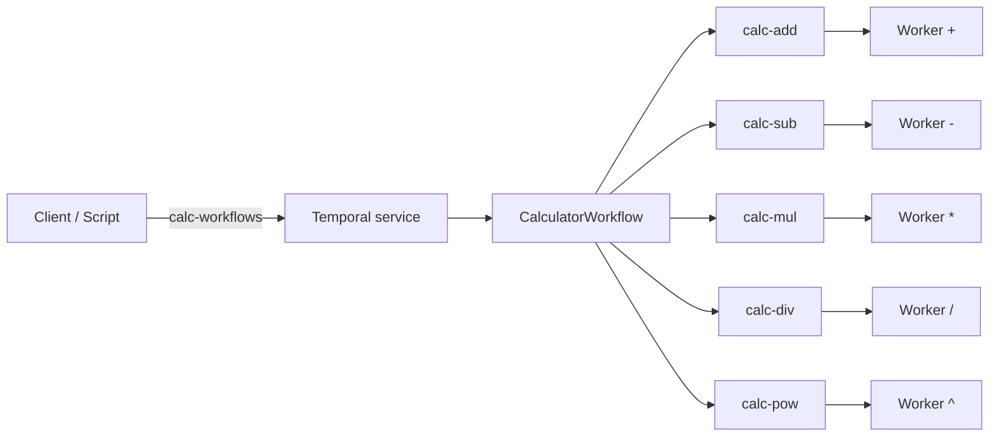

# temporal-worker-sdk-k8s

Python **Poetry** project with a reusable **Temporal worker SDK** (`temporal_worker_sdk`) and the reference **calculator** package (`calculator`) under `src/calculator/`. **Locked MVP decisions** and expectations-first scope: [specs/requirements/requirements-decisions.md](specs/requirements/requirements-decisions.md). **Post-MVP / production backlog:** [FUTURE.md](FUTURE.md). **Cross-cutting guardrails** (pre-deploy checklist, security, performance, DevOps notes): [specs/requirements/requirements-architecture.md#cross-cutting-guardrails](specs/requirements/requirements-architecture.md#cross-cutting-guardrails).

## Prerequisites

- Python **3.11+**
- [Poetry](https://python-poetry.org/docs/#installation)
- For **Kubernetes** on minikube: Docker (or compatible container runtime), `kubectl`, and [minikube](https://minikube.sigs.k8s.io/docs/start/) — see [Local Kubernetes (minikube)](#local-kubernetes-minikube).

## Install

```bash
poetry install
```

## Worker environment variables

The tables below map process environment variables to the **MVP locked names** in [specs/requirements/requirements-decisions.md](specs/requirements/requirements-decisions.md). Where the decisions doc describes **Temporal address and namespace** for manifests (ConfigMap / deploy), the **worker process** reads them as **`TEMPORAL_ADDRESS`** and **`TEMPORAL_NAMESPACE`** — the SDK’s stable contract for bootstrap code.

### Required (fail fast if missing or blank)

| Variable | Purpose |
|----------|---------|
| `TEMPORAL_ADDRESS` | gRPC target for the Temporal frontend (MVP stack documents port **7233**). |
| `TEMPORAL_NAMESPACE` | Temporal namespace for this worker. |
| `TEMPORAL_TASK_QUEUE` | Task queue this worker polls. MVP queue short names: `calc-workflows`, `calc-add`, `calc-sub`, `calc-mul`, `calc-div`, `calc-pow` (see decisions doc). |

**Required for any running worker:** `TEMPORAL_ADDRESS`, `TEMPORAL_NAMESPACE`, `TEMPORAL_TASK_QUEUE`.

### Optional (names locked in decisions doc)

| Variable | Default | Purpose |
|----------|---------|---------|
| `WORKER_ROLE` | unset | Reference image roles: `workflow` \| `add` \| `sub` \| `mul` \| `div` \| `pow` (see **Worker image** row in decisions doc). Optional for generic SDK use; set per Deployment in MVP. |
| `TEMPORAL_IDENTITY` | unset | Worker identity string passed to the Temporal client when present. |
| `LOG_JSON` | off | When truthy (`1`, `true`, `yes`, `on`, case-insensitive), logs use JSON to stdout per **Logging** row. |
| `TEMPORAL_WORKER_HEALTH_ADDR` | unset | When set (e.g. `0.0.0.0:8080`), the SDK serves `/livez`, `/readyz`, `/metrics` on that bind address (**Health / metrics bind (SDK)** row). Unset = no HTTP listener (backward compatible). |
| `TEMPORAL_WORKER_GRACEFUL_SHUTDOWN_TIMEOUT_SEC` | `30` | Passed to Temporal `Worker(graceful_shutdown_timeout=…)` — time after SIGTERM/`shutdown()` for in-flight activities to finish before cancellation (see [Temporal worker docs](https://docs.temporal.io/develop/python/python-sdk)). |
| `TEMPORAL_WORKER_SHUTDOWN_MAX_WAIT_SEC` | `120` | Upper bound for `await worker.shutdown()` after **SIGINT** / **SIGTERM**. If exceeded, the process logs an error and exits with code **124** (in addition to Temporal’s graceful activity window above). |
| `TEMPORAL_WORKER_LOG_PAYLOADS_DEBUG` | off | When truthy, **DEBUG** logs may include **truncated** workflow/activity argument previews (length + hash). **INFO** never logs full raw payloads (per **Logging** row in the decisions doc). |

### Graceful shutdown (SIGTERM / SIGINT)

- The SDK registers **SIGINT** and **SIGTERM** (where the host supports them) and calls Temporal’s `worker.shutdown()` so polling stops and the worker drains per `TEMPORAL_WORKER_GRACEFUL_SHUTDOWN_TIMEOUT_SEC`.
- **Kubernetes** sends **SIGTERM** to the container entrypoint on pod termination; align `terminationGracePeriodSeconds` with the graceful timeout + buffer.
- **Windows:** `asyncio` may not support `add_signal_handler` for every signal; the SDK falls back to `signal.signal` when needed. **Ctrl+C** (SIGINT) is always a reliable local stop. Document production expectations with your platform team if SIGTERM is uncertain.

### Structured logging

- **Text (default):** lines include `queue=` and `namespace=` from config; activity/workflow logs add `workflow_id`, `workflow_run_id`, and type names when the Temporal context provides them.
- **JSON (`LOG_JSON`):** one JSON object per line with `ts`, `level`, `logger`, `message`, and the same correlation fields as attributes on the record.
- **Payloads:** at **INFO**, workflow/activity **arguments** are omitted. With **`TEMPORAL_WORKER_LOG_PAYLOADS_DEBUG`**, **DEBUG** may log a short repr preview (see env table). Do not put secrets in workflow/activity inputs.

### Prometheus metrics (low cardinality)

Metrics are registered on an isolated registry and exposed only when **`TEMPORAL_WORKER_HEALTH_ADDR`** is set (**`/metrics`** on the same port as health checks). Labels are limited to **`activity`** name and fixed **`outcome`** values — never workflow id or run id.

| Metric | Type | Labels | Meaning |
|--------|------|--------|---------|
| `temporal_worker_activity_starts_total` | Counter | `activity` | Activity tasks started on this worker |
| `temporal_worker_activity_completions_total` | Counter | `activity`, `outcome` (`success` / `failure` / `cancelled`) | Terminal outcomes |
| `temporal_worker_activity_execution_seconds` | Histogram | `activity` | Wall time inside the activity callable |
| `temporal_worker_activity_schedule_to_start_seconds` | Histogram | `activity` | Time from server `scheduled_time` to execute start (queue + poll proxy) |

**Histogram bucket boundaries** (fixed for comparable scrapes) are defined as module constants in [`src/temporal_worker_sdk/metrics.py`](src/temporal_worker_sdk/metrics.py): `ACTIVITY_EXECUTION_BUCKETS` and `ACTIVITY_SCHEDULE_TO_START_BUCKETS`.

### Health probes

When **`TEMPORAL_WORKER_HEALTH_ADDR`** is set:

| Path | Purpose |
|------|---------|
| `/livez` | **Liveness** — HTTP 200 if the process is serving (always 200 while the server thread is up). |
| `/readyz` | **Readiness** — HTTP 200 after the Temporal worker has started polling; **503** before that, and **503** after a shutdown signal (draining). |
| `/metrics` | Prometheus scrape endpoint (text format). |

### Kubernetes probe snippet

Use the same port as `TEMPORAL_WORKER_HEALTH_ADDR` (container port). Example:

```yaml
env:
  - name: TEMPORAL_WORKER_HEALTH_ADDR
    value: "0.0.0.0:8080"
ports:
  - containerPort: 8080
    name: probes
livenessProbe:
  httpGet:
    path: /livez
    port: probes
  initialDelaySeconds: 5
  periodSeconds: 10
readinessProbe:
  httpGet:
    path: /readyz
    port: probes
  initialDelaySeconds: 5
  periodSeconds: 5
```

**Scrape:** configure Prometheus to pull `http://<pod-ip>:8080/metrics` (or a `ServiceMonitor` / Pod annotation pattern your stack uses); keep scrape interval reasonable to avoid overload.

## Public API (integration surface)

Other code should import only from the package root:

- **`run_worker`** — blocking entrypoint: loads config from the environment, connects, polls the configured task queue with the given workflow and activity callables.
- **`run_worker_async`** — same behavior for async callers.
- **`load_worker_config`** / **`WorkerConfig`** / **`ConfigError`** — typed env loading and validation.

Docstrings on those symbols describe parameters. Example that uses **only** the public API:

- [examples/minimal_worker.py](examples/minimal_worker.py)

```bash
set TEMPORAL_ADDRESS=127.0.0.1:7233
set TEMPORAL_NAMESPACE=default
set TEMPORAL_TASK_QUEUE=calc-workflows
poetry run python examples/minimal_worker.py
```

(On Unix, use `export` instead of `set`.)

## Calculator API (workflow + activities)

Canonical contract (names, queues, limits, errors): [specs/features/api-workflow-activity-contracts.md](specs/features/api-workflow-activity-contracts.md). Code constants live in `calculator.contracts`; failures and limits are documented in `calculator.errors` and `calculator.limits`. **Where parsing runs:** the expression is parsed and the AST is built **inside the workflow** (deterministic); rationale and rejected alternative (parse activity) are recorded in [docs/adr/0001-parse-in-workflow.md](docs/adr/0001-parse-in-workflow.md).

**Workflow:** `CalculatorWorkflow` on task queue **`calc-workflows`**. **Input:** expression `str`. **Output:** final result `str` (see **Numeric model**). **Numeric model:** `decimal.Decimal` on the wire as **`str`** between activities; **quantize once** at workflow completion to **2 decimal places** with **`ROUND_UP`** ([requirements-decisions.md](specs/requirements/requirements-decisions.md)). **Precedence / associativity:** `^` > `* /` > `+ -`; **left-associative** at each level, including `^` (e.g. `2^3^2` → `(2^3)^2` = 64) — [requirements-decisions.md](specs/requirements/requirements-decisions.md). **Input limits (MVP):** max **4096** characters after ignorable whitespace strip; max **512** binary operators in the parsed expression; both in [requirements-decisions.md](specs/requirements/requirements-decisions.md) and `calculator.limits`.

**Per-operator activities** (each binary op runs on its own queue; activity payloads are `str` decimals on the wire):

| Operator | Activity name | Task queue |
|----------|---------------|------------|
| `+` | `add` | `calc-add` |
| `-` | `subtract` | `calc-sub` |
| `*` | `multiply` | `calc-mul` |
| `/` | `divide` | `calc-div` |
| `^` | `power` | `calc-pow` |

**Temporal timeouts and retries (calculator reference)** — aligned with [specs/requirements/requirements-decisions.md](specs/requirements/requirements-decisions.md) (**Temporal timeouts (MVP)**):

| Scope | Default | Notes |
|-------|---------|--------|
| Activity start-to-close | **60s** | Same for all five operator activities (`calculator.workflow`). |
| Workflow run (starter) | **15 minutes** suggested | Set on `execute_workflow` / client start; expressions scale roughly **linearly** in history and latency with **binary operator count** (one activity per binary op). |
| Activity retries | **Up to 5 attempts**, 1s initial backoff, ×2 coefficient, 30s max interval | Transient / infra failures. **Domain** failures (`ApplicationError` with `non_retryable=True`, e.g. division by zero, parse/limit errors) are **not** retried. |

Starters and workers should import **`WORKFLOW_NAME`**, **`WORKFLOW_TASK_QUEUE`**, and routing via **`activity_and_queue_for_binary_operator`** from `calculator.contracts` (or the `calculator` package root re-exports) so names stay aligned.

**Versioning** when changing workflow behavior or type names: see the **Versioning** section in the API spec above and [CHANGELOG.md](CHANGELOG.md).

## Design (topology)

Same topology as [requirements-architecture.md](specs/requirements/requirements-architecture.md) (six workers: one workflow + five operator queues):



## Testing

**Local:** unit tests do not start Temporal.

```bash
poetry run pytest -m "not integration"
```

**CI:** GitHub Actions runs `poetry check` and the same unit test selection (no cluster, no Temporal).

**Integration (local):** tests marked `@pytest.mark.integration` start the Temporal **time-skipping** test server (first run may download a binary). Example: `poetry run pytest tests/test_calculator_workflow_integration.py`.

## Pre-deploy (local minikube)

Before you treat the stack as **evaluator-ready**, run through this gate (detail and rationale: [Cross-cutting guardrails — Pre-deploy](specs/requirements/requirements-architecture.md#cross-cutting-guardrails)):

- **Tests** — Unit suite green (`poetry run pytest -m "not integration"`); optional Temporal integration locally per [requirements-decisions.md](specs/requirements/requirements-decisions.md) (CI does not run integration for MVP).
- **App DB migrations** — None; Postgres and Temporal come from manifests.
- **Config / secrets** — Env vars and Kubernetes **Secret** for Postgres documented; no cleartext credentials in Git.
- **Dependencies** — [poetry.lock](poetry.lock) committed; optional CVE audit per decisions doc.
- **Smoke** — Worker readiness probes **Ready** after deploy; [trigger script](#trigger-a-complex-workflow-host-python) succeeds; see [feature-kubernetes-deployment.md](specs/features/feature-kubernetes-deployment.md) for runbook alignment.

## Local Kubernetes (minikube)

MVP stack (namespace **`temporal`**): in-cluster **PostgreSQL** → **`temporalio/auto-setup`** → **six** calculator worker Deployments. Manifests live under [`k8s/`](k8s/); pinned image tags are recorded in those files and summarized below.

**Minikube:** default profile (~2 CPUs / ~2Gi RAM) is enough for the **requests** declared in manifests; if pods stay **Pending** or are OOM-killed, raise node resources (`minikube config set cpus 4`, `minikube config set memory 4096`, then recreate the cluster). Worker **limits** (500m CPU / 512Mi each) and Temporal **limits** are documented in `k8s/workers.yaml` and `k8s/temporal.yaml` — tune if the control plane throttles workloads.

**Pinned images (see YAML for source of truth):**

| Component | Image |
|-----------|--------|
| PostgreSQL | `postgres:16.4-alpine` |
| Temporal | `temporalio/auto-setup:1.29.1` |
| Calculator workers | `calculator-worker:0.1.0` (local build) |

**`temporalio/auto-setup` DB env** matches [temporalio/docker-compose `docker-compose-postgres.yml`](https://github.com/temporalio/docker-compose/blob/main/docker-compose-postgres.yml): `DB=postgres12`, `DB_PORT=5432`, `POSTGRES_SEEDS` → in-cluster Service name **`postgres`**, credentials from the same Kubernetes Secret as the Postgres Deployment.

### Worker container image (Docker)

The repo [`Dockerfile`](Dockerfile) is a **multi-stage** build: install dependencies with Poetry, copy `src/`, run as **non-root** UID/GID **10001**. **Docker `HEALTHCHECK`:** not defined on purpose — Kubernetes **HTTP probes** against `/livez` and `/readyz` are the supported health surface when `TEMPORAL_WORKER_HEALTH_ADDR` is set (see [Health probes](#health-probes)). Adding a Docker `HEALTHCHECK` is optional for local `docker run`; production-style clusters should rely on the manifests’ probes.

Build and tag (from repo root):

```bash
docker build -t calculator-worker:0.1.0 .
```

Load into minikube’s node image store:

```bash
minikube image load calculator-worker:0.1.0
```

Worker pods use `imagePullPolicy: Never` so the node uses the loaded tag.

### PostgreSQL Secret (no cleartext in git)

**Do not** commit real passwords. Create the Secret once per cluster (keys **`POSTGRES_USER`** and **`POSTGRES_PASSWORD`**):

```bash
kubectl -n temporal create secret generic postgres-credentials \
  --from-literal=POSTGRES_USER=temporal \
  --from-literal=POSTGRES_PASSWORD='<strong-password>'
```

Alternatively copy [`k8s/postgres-secret.yaml.example`](k8s/postgres-secret.yaml.example) to a **local, untracked** file, replace `CHANGE_ME_BEFORE_APPLY`, then `kubectl apply -f` that file.

### Deploy (scripts)

From repo root, after the Secret exists and the worker image is loaded:

```bash
chmod +x scripts/deploy.sh   # once, on Unix
./scripts/deploy.sh
# Optional bonus HPA: ./scripts/deploy.sh --with-hpa  (or DEPLOY_CALCULATOR_HPA=1)
```

Windows (PowerShell):

```powershell
.\scripts\deploy.ps1
# Optional bonus HPA:
.\scripts\deploy.ps1 -ApplyHpa
```

Both scripts fail fast if `kubectl` cannot reach a cluster or the Secret is missing. **Default deploy does not apply HPA**; see [Autoscaling (bonus)](#autoscaling-bonus).

### Deploy (raw `kubectl`, same order as scripts)

```bash
kubectl apply -f k8s/namespace.yaml
kubectl apply -f k8s/temporal-dynamic-config.yaml
kubectl apply -f k8s/postgres.yaml
kubectl apply -f k8s/temporal.yaml
kubectl apply -f k8s/calculator-worker-configmap.yaml
kubectl apply -f k8s/workers.yaml
# Optional bonus HPA (needs metrics-server):
# kubectl apply -f k8s/calculator-worker-add-hpa.yaml
```

Wait for core services:

```bash
kubectl -n temporal rollout status deployment/postgres
kubectl -n temporal rollout status deployment/temporal
kubectl -n temporal rollout status deployment/calculator-worker-workflow
```

### Trigger a complex workflow (host Python)

Forward the Temporal frontend to **localhost only** (avoid binding `0.0.0.0` on shared networks — do not expose Temporal to the LAN unintentionally):

```bash
kubectl port-forward -n temporal svc/temporal 127.0.0.1:7233:7233
```

In another terminal (repo root, Poetry env):

```bash
poetry run python scripts/trigger_calculator_workflow.py
```

Optional: pass an expression as the first argument or set `CALC_EXPRESSION`. The default uses `+`, `*`, `/`, `^`, and parentheses. On success the script prints the final **decimal string**; on failure it prints `workflow_failed: …` to stderr and exits non-zero.

### Autoscaling (bonus)

This is **optional** P2 scope ([`specs/features/feature-autoscaling-bonus.md`](specs/features/feature-autoscaling-bonus.md)). MVP horizontal scaling uses **CPU utilization** from the Kubernetes **Metrics API** on **one** activity worker: Deployment **`calculator-worker-add`**, via [`k8s/calculator-worker-add-hpa.yaml`](k8s/calculator-worker-add-hpa.yaml).

#### AS-01 — Metrics prerequisite (CPU signal)

HPA’s built-in **CPU** metric is served by **metrics-server** (`metrics.k8s.io`), which aggregates **kubelet** container stats. It is **not** the same as scraping application Prometheus metrics from the worker’s `/metrics` endpoint.

Verify metrics-server before relying on HPA:

```bash
kubectl get apiservice v1beta1.metrics.k8s.io -o jsonpath='{.status.conditions[?(@.type=="Available")].status}{"\n"}'
# Expect: True
kubectl top nodes
# Expect: CPU/memory columns (may show "<unknown>" for ~1 minute after install)
```

**minikube:** `minikube addons enable metrics-server` (and wait until the API service is Available).

If `v1beta1.metrics.k8s.io` is missing or not Available, `kubectl top` and CPU-based HPA will not work.

#### AS-02 — Why CPU, and limitations

| Topic | Notes |
|--------|--------|
| **Why CPU (demo)** | No custom metrics stack required; works on a stock cluster with metrics-server; correlates with busy worker processes under synthetic load. |
| **Lag** | HPA reacts to **smoothed** utilization over several kubelet/metrics-server windows (order of **1–3 minutes** typical), not instantaneous queue depth. |
| **Queue vs CPU** | Temporal **task-queue backlog** is not visible to default HPA; CPU can be **low** while work waits (I/O-bound, blocked workers) or **misleading** if other processes share the node (**noisy neighbors**). |
| **Server bottleneck** | Scaling workers does not help if **Temporal frontend/history** or **Postgres** is the limit. |
| **Scale-down** | This repo sets a **5-minute** scale-down stabilization window on the HPA to reduce flapping. Cluster policies (**PDBs**, cluster autoscaler, eviction) can still delay or block replica decreases. |

#### AS-03 — HPA thresholds (manifest)

| Setting | Value |
|---------|--------|
| Target | `Deployment/calculator-worker-add` |
| Min / max replicas | **1** / **5** |
| CPU target | **65%** of **requested** CPU (`100m` per pod in [`k8s/workers.yaml`](k8s/workers.yaml)) |
| Scale-down | **300s** stabilization + percent policy (see manifest) |

**Expected behavior:** under sustained concurrent workflows that stress **`calc-add`**, replica count should **rise above 1** after metrics reflect CPU over target (often **several minutes**). After load stops, expect **gradual** scale-down following the stabilization window; document your cluster if scale-down is blocked.

Inspect: `kubectl -n temporal get hpa calculator-worker-add -w`

#### AS-04 — Stress test (evidence)

With port-forward to Temporal (see above) and HPA applied, run from repo root:

```bash
poetry run python scripts/stress_calculator_workers.py \
  --concurrency 16 --duration-sec 420
```

Environment overrides: `STRESS_CONCURRENCY`, `STRESS_DURATION_SEC`, `CALC_EXPRESSION`, `STRESS_K8S_NAMESPACE`, `STRESS_K8S_DEPLOYMENT`.

The script prints **before/after** lines for Deployment **spec/ready/available** replicas (via `kubectl`) and **workflow latency** min / p50 / p95 / max. It also attempts `kubectl top pods` for CPU evidence (falls back to all pods in the namespace if the label filter is unavailable).

**Documenting claims:** paste a short run transcript into your notes or PR: replica counts, latency lines, and one `kubectl top` snapshot. Example shape (values depend on cluster):

| Phase | `calculator-worker-add` replicas (ready) | Latency p50 (s) | Worker CPU snapshot |
|-------|------------------------------------------|-----------------|---------------------|
| Before stress | 1/1 | — | (baseline) |
| After ~7m stress | 3–5 | (from script output) | from script `kubectl_top_pods` |

#### AS-05 — Deploy path summary

| Path | HPA |
|------|-----|
| `./scripts/deploy.sh` or `deploy.ps1` (no flags) | **Off** |
| `./scripts/deploy.sh --with-hpa` or `DEPLOY_CALCULATOR_HPA=1` | **On** |
| `deploy.ps1 -ApplyHpa` | **On** |
| Raw `kubectl` | Apply [`k8s/calculator-worker-add-hpa.yaml`](k8s/calculator-worker-add-hpa.yaml) manually when needed |

### Data volume

Postgres uses **`emptyDir`** in [`k8s/postgres.yaml`](k8s/postgres.yaml): data is **ephemeral** when the pod is deleted or rescheduled without a PVC. Replacing it with a PVC is a documented upgrade path in [FUTURE.md](FUTURE.md).

### kind (optional)

kind generally works if you **load** the worker image into each node (`kind load docker-image calculator-worker:0.1.0`) and use a compatible ingress or port-forward; **minikube** remains the documented primary path.

### Troubleshooting

| Symptom | What to try |
|--------|-------------|
| `kubectl` errors / wrong cluster | `kubectl config current-context`; point at minikube (`kubectl config use-context minikube`). |
| `ImagePullBackOff` on workers | Build and `minikube image load calculator-worker:0.1.0`; manifests use `imagePullPolicy: Never`. |
| `CreateContainerConfigError` on postgres/temporal | Secret `postgres-credentials` missing or keys wrong — see [PostgreSQL Secret](#postgresql-secret-no-cleartext-in-git). |
| Connection refused on port-forward | `kubectl -n temporal get pods`; wait until `temporal-*` is Ready; check Service `temporal` exists. |
| Wrong namespace | All MVP resources are in namespace **`temporal`** (`kubectl -n temporal …`). |
| Logs | `kubectl -n temporal logs deploy/calculator-worker-workflow` (substitute deployment name). |
| Stuck rollout | `kubectl -n temporal rollout status deploy/<name>`; rollback workers with `kubectl -n temporal rollout undo deploy/calculator-worker-workflow` (repeat per worker Deployment as needed). |
| Lost data | Expected if Postgres used `emptyDir` or a PVC was deleted — see [Data volume](#data-volume). |
| HPA / metrics (bonus) | See [Autoscaling (bonus)](#autoscaling-bonus): **metrics-server**, verification commands, and optional deploy flags. |

## Changelog and versioning

See [CHANGELOG.md](CHANGELOG.md) for semantic versioning rules and release notes.

## More documentation

- [specs/requirements/requirements-architecture.md](specs/requirements/requirements-architecture.md) — architecture, task queues, tradeoffs (includes **Cross-cutting guardrails**)
- [docs/adr/0001-parse-in-workflow.md](docs/adr/0001-parse-in-workflow.md) — parse-in-workflow decision (Context / Decision / Consequences)
- [specs/requirements-project.md](specs/requirements/requirements-project.md) — scope and expectations  
- [specs/requirements-llm-disclosure.md](specs/requirements/requirements-llm-disclosure.md) — LLM use disclosure when applicable  
- Task order: [specs/tasks/priority-and-dependency-order.md](specs/tasks/priority-and-dependency-order.md)
