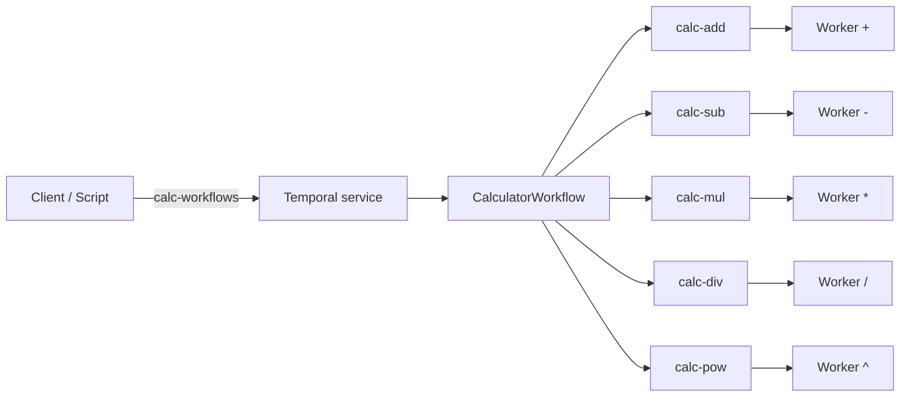

# Temporal worker SDK + calculator (Kubernetes)

Python **`temporal_worker_sdk`**: env-based worker bootstrap, graceful shutdown, structured logs, and optional HTTP **`/livez`**, **`/readyz`**, **`/metrics`**. Reference app **`calculator`**: one expression workflow on **`calc-workflows`**, five operator activities each on its own task queue. Repo includes **`k8s/`** manifests, deploy scripts, and a workflow trigger script.

**PostgreSQL** in the manifests is **Temporal’s persistence** (workflow history, etc.). Workers talk to Temporal on gRPC only.

## Documentation

| Topic | Link |
|-------|------|
| Env names, queues, timeouts, rounding | [specs/requirements/requirements-decisions.md](specs/requirements/requirements-decisions.md) |
| Architecture and tradeoffs | [specs/requirements/requirements-architecture.md](specs/requirements/requirements-architecture.md) |
| Workflow/activity contract | [specs/features/api-workflow-activity-contracts.md](specs/features/api-workflow-activity-contracts.md) |
| Why parsing runs in the workflow | [docs/adr/0001-parse-in-workflow.md](docs/adr/0001-parse-in-workflow.md) |
| Backlog / not done yet | [FUTURE.md](FUTURE.md) |
| LLM use (disclosure) | [specs/requirements/requirements-llm-disclosure.md](specs/requirements/requirements-llm-disclosure.md) |
| Changelog | [CHANGELOG.md](CHANGELOG.md) |

## Prerequisites

- Python **3.11+**, [Poetry](https://python-poetry.org/docs/#installation)
- For the cluster path: container runtime, `kubectl`, [minikube](https://minikube.sigs.k8s.io/docs/start/) (or another cluster with kubeconfig set)

## Quick start

**Install and unit tests** (no Temporal server):

```bash
poetry install

poetry run pytest -m "not integration"
```

**Minikube, end-to-end**

1. Start the cluster and confirm `kubectl` reaches the API:

```bash
minikube start

kubectl cluster-info
```

2. Create the `temporal` namespace, then the Postgres secret (full commands under [Postgres secret](#postgres-secret)):

```bash
kubectl apply -f k8s/namespace.yaml
```

3. Build the worker image and load it into minikube:

```bash
docker build -t calculator-worker:0.1.0 .

minikube image load calculator-worker:0.1.0
```

4. Deploy (requires Secret `temporal/postgres-credentials`):

```bash
chmod +x scripts/deploy.sh

./scripts/deploy.sh
```

```powershell
.\scripts\deploy.ps1
```

5. Wait until pods are Ready, then port-forward Temporal (leave this running):

```bash
kubectl -n temporal get pods

kubectl port-forward -n temporal svc/temporal --address 127.0.0.1 7233:7233
```

6. In another shell, run the trigger:

```bash
poetry run python scripts/trigger_calculator_workflow.py
```

**Optional HPA** (needs [metrics-server](#autoscaling)):

```bash
./scripts/deploy.sh --with-hpa
```

```bash
DEPLOY_CALCULATOR_HPA=1 ./scripts/deploy.sh
```

```powershell
.\scripts\deploy.ps1 -ApplyHpa
```

## Worker environment variables

| Variable | Required | Default | Purpose |
|----------|----------|---------|---------|
| `TEMPORAL_ADDRESS` | yes | — | Temporal frontend gRPC target (bundled stack: **7233**) |
| `TEMPORAL_NAMESPACE` | yes | — | Temporal namespace |
| `TEMPORAL_TASK_QUEUE` | yes | — | Queue this worker polls |
| `WORKER_ROLE` | no | — | Reference image: `workflow` / `add` / `sub` / `mul` / `div` / `pow` |
| `TEMPORAL_IDENTITY` | no | — | Worker identity when set |
| `LOG_JSON` | no | off | Truthy → JSON logs |
| `TEMPORAL_WORKER_HEALTH_ADDR` | no | — | e.g. `0.0.0.0:8080` → `/livez`, `/readyz`, `/metrics`; unset → no HTTP server |
| `TEMPORAL_WORKER_GRACEFUL_SHUTDOWN_TIMEOUT_SEC` | no | `30` | Passed to Temporal worker graceful shutdown |
| `TEMPORAL_WORKER_SHUTDOWN_MAX_WAIT_SEC` | no | `120` | Max wait on shutdown after signal; exit **124** if exceeded |
| `TEMPORAL_WORKER_LOG_PAYLOADS_DEBUG` | no | off | Truthy → DEBUG may log truncated arg previews |

**Signals:** SIGINT/SIGTERM run `worker.shutdown()` (drain activities within graceful timeout). Size Kubernetes `terminationGracePeriodSeconds` with that timeout plus margin. **Windows:** rely on Ctrl+C locally; confirm SIGTERM for your runtime in production.

**Logs:** text lines include `queue=` / `namespace=`; JSON adds `ts`, `level`, `logger`, `message`, and workflow fields when present. Do not pass secrets in workflow/activity inputs.

**Metrics** (only if `TEMPORAL_WORKER_HEALTH_ADDR` is set, path **`/metrics`**): counters/histograms `temporal_worker_activity_*` with labels **`activity`** and fixed **`outcome`** — no workflow or run id labels. Buckets: [`src/temporal_worker_sdk/metrics.py`](src/temporal_worker_sdk/metrics.py).

**Probe paths:** `/livez` liveness; `/readyz` readiness (503 until polling or while draining); `/metrics` scrape. Example probes: [`k8s/workers.yaml`](k8s/workers.yaml).

## Public API

From **`temporal_worker_sdk`**: **`run_worker`**, **`run_worker_async`**, **`load_worker_config`**, **`WorkerConfig`**, **`ConfigError`**.

Unix / macOS:

```bash
export TEMPORAL_ADDRESS=127.0.0.1:7233
export TEMPORAL_NAMESPACE=default
export TEMPORAL_TASK_QUEUE=calc-workflows

poetry run python examples/minimal_worker.py
```

Windows (cmd):

```bat
set TEMPORAL_ADDRESS=127.0.0.1:7233
set TEMPORAL_NAMESPACE=default
set TEMPORAL_TASK_QUEUE=calc-workflows

poetry run python examples/minimal_worker.py
```

Set `TEMPORAL_WORKER_HEALTH_ADDR` to enable probes and `/metrics` without changing worker code. Source: [examples/minimal_worker.py](examples/minimal_worker.py).

## Calculator workflow

Contract and limits: **`calculator.contracts`**, **`calculator.limits`**, **`calculator.errors`**, and the [API contract doc](specs/features/api-workflow-activity-contracts.md). Expression is parsed **inside the workflow** (deterministic). Input/output: strings; decimals as strings; final quantize **two places, ROUND_UP**; precedence **`^` > `* /` > `+ -`**, left-associative per level.

| Op | Activity | Queue |
|----|-----------|-------|
| `+` | `add` | `calc-add` |
| `-` | `subtract` | `calc-sub` |
| `*` | `multiply` | `calc-mul` |
| `/` | `divide` | `calc-div` |
| `^` | `power` | `calc-pow` |

Starter uses **15m** execution timeout; activities **60s** start-to-close, retry policy up to **5** attempts (domain errors non-retryable). Prefer **`WORKFLOW_NAME`**, **`WORKFLOW_TASK_QUEUE`**, **`activity_and_queue_for_binary_operator`** from `calculator.contracts` for stable names.

## Topology

Six workers: **one** polls **`calc-workflows`** and runs **`CalculatorWorkflow`**; **five** poll **`calc-add`** … **`calc-pow`** (one binary operator each). The client starts the workflow on **`calc-workflows`**; Temporal delivers workflow tasks to the workflow worker and activity tasks to the operator workers.



**Tradeoffs** (per-queue workers, parsing location, probes, limits, semantics) are written as **Decision** sections with pros, cons, and consequences in [specs/requirements/requirements-architecture.md](specs/requirements/requirements-architecture.md) — same diagram is maintained there.

## Kubernetes

**Namespace `temporal`:** Postgres, `temporalio/auto-setup`, six calculator Deployments. If `kubectl` errors with `localhost:8080` / `[::1]:8080`, there is no API server in the current context — start the cluster and fix context, for example:

```bash
kubectl config use-context minikube

kubectl cluster-info
```

**Resources:** roughly **2 CPU / 2Gi** on minikube matches requests; raise if pods stay Pending or OOM.

**Images** (pin in YAML):

| Part | Image |
|------|--------|
| Postgres | `postgres:16.4-alpine` |
| Temporal | `temporalio/auto-setup:1.29.1` |
| Workers | `calculator-worker:0.1.0` (local build, `imagePullPolicy: Never`) |

**Dockerfile** ([Dockerfile](Dockerfile)): multi-stage, non-root UID **10001**, `CMD` `python -m calculator.worker_main`. No Docker `HEALTHCHECK`; use K8s HTTP probes when health addr is set.

### Postgres secret

The `temporal` namespace must exist before the secret:

```bash
kubectl apply -f k8s/namespace.yaml
```

Create the secret once per cluster:

```bash
kubectl -n temporal create secret generic postgres-credentials \
  --from-literal=POSTGRES_USER=temporal \
  --from-literal=POSTGRES_PASSWORD='<strong-password>'
```

PowerShell (use `` ` `` for line continuation, not `\`):

```powershell
kubectl -n temporal create secret generic postgres-credentials `
  --from-literal=POSTGRES_USER=temporal `
  --from-literal=POSTGRES_PASSWORD='<strong-password>'
```

Or copy [k8s/postgres-secret.yaml.example](k8s/postgres-secret.yaml.example) to an untracked file, edit values, then:

```bash
kubectl apply -f your-local-secret.yaml
```

### Deploy

Same as step 4 under [Quick start](#quick-start). Manual apply order (matches the scripts):

```bash
kubectl apply -f k8s/namespace.yaml
kubectl apply -f k8s/temporal-dynamic-config.yaml
kubectl apply -f k8s/postgres.yaml
kubectl apply -f k8s/temporal.yaml
kubectl apply -f k8s/calculator-worker-configmap.yaml
kubectl apply -f k8s/workers.yaml
```

Optional HPA manifest:

```bash
kubectl apply -f k8s/calculator-worker-add-hpa.yaml
```

Optional rollout checks:

```bash
kubectl -n temporal rollout status deployment/postgres
kubectl -n temporal rollout status deployment/temporal
kubectl -n temporal rollout status deployment/calculator-worker-workflow
```

### Trigger (host)

After port-forward (step 5 in [Quick start](#quick-start)):

```bash
poetry run python scripts/trigger_calculator_workflow.py
```

Optional: pass the expression as the first argument, or set **`CALC_EXPRESSION`**. Connection overrides: **`TEMPORAL_ADDRESS`**, **`TEMPORAL_NAMESPACE`**, or **`--address`**, **`--namespace`** (defaults `127.0.0.1:7233`, `default`). On failure the process prints `workflow_failed: …` and exits non-zero.

### Autoscaling

HPA targets **`calculator-worker-add`** using **CPU** from the **metrics-server** API (not the app `/metrics` endpoint). **Why CPU:** works on a stock cluster without a custom metrics pipeline. **Limits:** reaction lag (~1–3 min), no queue-depth signal, CPU can mislead for I/O-bound work, scaling workers does not fix Temporal or Postgres bottlenecks.

Spec: [specs/features/feature-autoscaling-bonus.md](specs/features/feature-autoscaling-bonus.md). Manifest: [k8s/calculator-worker-add-hpa.yaml](k8s/calculator-worker-add-hpa.yaml).

**minikube — enable metrics-server:**

```bash
minikube addons enable metrics-server
```

**Verify metrics API:**

```bash
kubectl get apiservice v1beta1.metrics.k8s.io -o jsonpath='{.status.conditions[?(@.type=="Available")].status}{"\n"}'
```

```bash
kubectl top nodes
```

**Inspect HPA:**

```bash
kubectl -n temporal get hpa calculator-worker-add -w
```

**Stress test** (drive load for HPA demos):

```bash
poetry run python scripts/stress_calculator_workers.py \
  --concurrency 16 \
  --duration-sec 420
```

Optional environment variables (same names as CLI flags where applicable):

- `TEMPORAL_ADDRESS`, `TEMPORAL_NAMESPACE`
- `STRESS_CONCURRENCY`, `STRESS_DURATION_SEC`, `CALC_EXPRESSION`
- `STRESS_K8S_NAMESPACE`, `STRESS_K8S_DEPLOYMENT`

### kind (optional)

Load the local image into kind nodes:

```bash
kind load docker-image calculator-worker:0.1.0
```

### Data volume

Postgres uses **`emptyDir`** in [`k8s/postgres.yaml`](k8s/postgres.yaml): data is ephemeral if the pod is rescheduled. PVC-style follow-ups: [FUTURE.md](FUTURE.md).

### Troubleshooting

| Issue | What to run / check |
|-------|---------------------|
| `localhost:8080` refused | Start cluster, then `kubectl cluster-info` |
| Wrong cluster | `kubectl config current-context` |
| `ImagePullBackOff` | Rebuild and load: `docker build -t calculator-worker:0.1.0 .` then `minikube image load calculator-worker:0.1.0` |
| `CreateContainerConfigError` | Ensure secret exists: `kubectl -n temporal get secret postgres-credentials` |
| Port-forward fails | `kubectl -n temporal get pods` — wait for Temporal Ready |
| Logs | `kubectl -n temporal logs deploy/calculator-worker-workflow` |

## Testing

**CI-style checks:**

```bash
poetry check

poetry run pytest -m "not integration"
```

**Integration** (Temporal time-skipping server; first run may download a binary):

```bash
poetry run pytest tests/test_calculator_workflow_integration.py
```

## Future improvements

The MVP intentionally skips several production items. The living backlog is **[FUTURE.md](FUTURE.md)**; examples of deferred work:

- **Platform:** Temporal Helm or managed service, TLS/mTLS, backups, retention, multi-namespace strategy
- **Security:** NetworkPolicies, Pod Security, external secrets, image signing and SBOMs
- **Observability:** OpenTelemetry, dashboards and SLOs, stronger readiness if the SDK evolves
- **Scaling:** Queue-depth or latency-driven scaling (e.g. KEDA) instead of CPU-only HPA
- **SDK / domain:** Published package split from the demo app, Pydantic settings, richer calculator semantics if needed

## AI-assisted development

This project was built with **LLM-assisted** editing (e.g. Cursor) for implementation, tests, and documentation.

**Full disclosure** (prompt themes, planning, iterations, how to reduce rework): [specs/requirements/requirements-llm-disclosure.md](specs/requirements/requirements-llm-disclosure.md).

**Summary**

- **Prompts:** Temporal/Kubernetes worker bootstrap, probes, graceful shutdown; calculator parsing and workflow layout; pytest and docs clarity. Do not put secrets or internal URLs in disclosed prompts.
- **Planning:** `instructions` and `specs/` as the source of truth; non-obvious choices recorded in ADRs (e.g. parse location).
- **Iterations:** Multiple review-and-revise passes; see the disclosure file for depth.
- **Reducing rework:** Lock numeric and associativity rules early; agree on env and probe contracts before wide changes; add integration or smoke gates in CI when possible.
