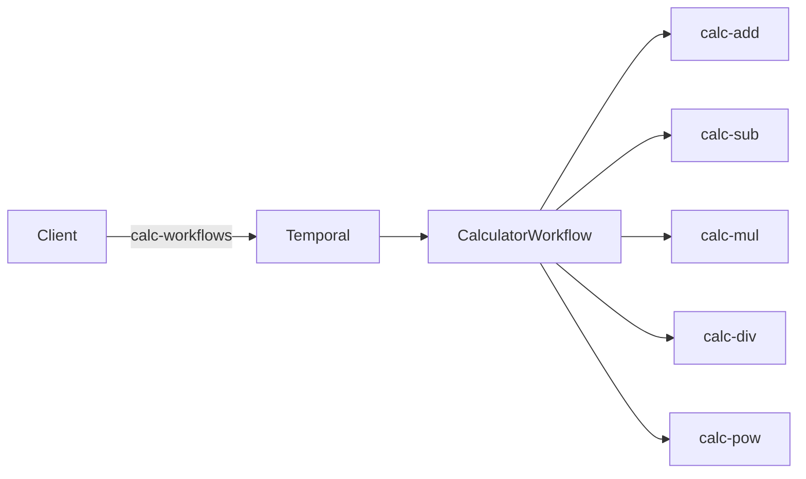

# Temporal worker SDK + calculator (Kubernetes)

Python **`temporal_worker_sdk`**: env-based worker bootstrap, graceful shutdown, structured logs, and optional HTTP **`/livez`**, **`/readyz`**, **`/metrics`**. Reference app **`calculator`**: one expression workflow on **`calc-workflows`**, five operator activities each on its own task queue. Repo includes **`k8s/`** manifests, deploy scripts, and a workflow trigger script.

**PostgreSQL** in the manifests is **Temporal’s persistence** (workflow history, etc.). Workers talk to Temporal on gRPC only.

## Documentation

| Topic | Link |
|-------|------|
| Env names, queues, timeouts, rounding | [specs/requirements/requirements-decisions.md](specs/requirements/requirements-decisions.md) |
| Architecture and tradeoffs | [specs/requirements/requirements-architecture.md](specs/requirements/requirements-architecture.md) |
| Workflow/activity contract | [specs/features/api-workflow-activity-contracts.md](specs/features/api-workflow-activity-contracts.md) |
| Why parsing runs in the workflow | [docs/adr/0001-parse-in-workflow.md](docs/adr/0001-parse-in-workflow.md) |
| Backlog / not done yet | [FUTURE.md](FUTURE.md) |
| LLM use (disclosure) | [specs/requirements/requirements-llm-disclosure.md](specs/requirements/requirements-llm-disclosure.md) |
| Changelog | [CHANGELOG.md](CHANGELOG.md) |

## Prerequisites

- Python **3.11+**, [Poetry](https://python-poetry.org/docs/#installation)
- For the cluster path: container runtime, `kubectl`, [minikube](https://minikube.sigs.k8s.io/docs/start/) (or another cluster with kubeconfig set)

## Quick start

**Install and unit tests** (no Temporal server):

```bash
poetry install
poetry run pytest -m "not integration"
```

**Minikube, end-to-end**

1. `minikube start` (or start your cluster); `kubectl cluster-info` should succeed.
2. `kubectl apply -f k8s/namespace.yaml`, then create the Postgres secret ([below](#postgres-secret)).
3. `docker build -t calculator-worker:0.1.0 .` and `minikube image load calculator-worker:0.1.0`.
4. `./scripts/deploy.sh` or `.\scripts\deploy.ps1` (fails if `temporal/postgres-credentials` is missing).
5. When pods are Ready (`kubectl -n temporal get pods`), port-forward: `kubectl port-forward -n temporal svc/temporal --address 127.0.0.1 7233:7233`. In another shell: `poetry run python scripts/trigger_calculator_workflow.py`.

**Optional HPA** (needs metrics-server): `./scripts/deploy.sh --with-hpa`, `DEPLOY_CALCULATOR_HPA=1`, or `.\scripts\deploy.ps1 -ApplyHpa`. See [Autoscaling](#autoscaling).

## Worker environment variables

| Variable | Required | Default | Purpose |
|----------|----------|---------|---------|
| `TEMPORAL_ADDRESS` | yes | — | Temporal frontend gRPC target (bundled stack: **7233**) |
| `TEMPORAL_NAMESPACE` | yes | — | Temporal namespace |
| `TEMPORAL_TASK_QUEUE` | yes | — | Queue this worker polls |
| `WORKER_ROLE` | no | — | Reference image: `workflow` / `add` / `sub` / `mul` / `div` / `pow` |
| `TEMPORAL_IDENTITY` | no | — | Worker identity when set |
| `LOG_JSON` | no | off | Truthy → JSON logs |
| `TEMPORAL_WORKER_HEALTH_ADDR` | no | — | e.g. `0.0.0.0:8080` → `/livez`, `/readyz`, `/metrics`; unset → no HTTP server |
| `TEMPORAL_WORKER_GRACEFUL_SHUTDOWN_TIMEOUT_SEC` | no | `30` | Passed to Temporal worker graceful shutdown |
| `TEMPORAL_WORKER_SHUTDOWN_MAX_WAIT_SEC` | no | `120` | Max wait on shutdown after signal; exit **124** if exceeded |
| `TEMPORAL_WORKER_LOG_PAYLOADS_DEBUG` | no | off | Truthy → DEBUG may log truncated arg previews |

**Signals:** SIGINT/SIGTERM run `worker.shutdown()` (drain activities within graceful timeout). Size Kubernetes `terminationGracePeriodSeconds` with that timeout plus margin. **Windows:** rely on Ctrl+C locally; confirm SIGTERM for your runtime in production.

**Logs:** text lines include `queue=` / `namespace=`; JSON adds `ts`, `level`, `logger`, `message`, and workflow fields when present. Do not pass secrets in workflow/activity inputs.

**Metrics** (only if `TEMPORAL_WORKER_HEALTH_ADDR` is set, path **`/metrics`**): counters/histograms `temporal_worker_activity_*` with labels **`activity`** and fixed **`outcome`** — no workflow or run id labels. Buckets: [`src/temporal_worker_sdk/metrics.py`](src/temporal_worker_sdk/metrics.py).

**Probe paths:** `/livez` liveness; `/readyz` readiness (503 until polling or while draining); `/metrics` scrape. Example probes: [`k8s/workers.yaml`](k8s/workers.yaml).

## Public API

From **`temporal_worker_sdk`**: **`run_worker`**, **`run_worker_async`**, **`load_worker_config`**, **`WorkerConfig`**, **`ConfigError`**.

```bash
# Windows
set TEMPORAL_ADDRESS=127.0.0.1:7233
set TEMPORAL_NAMESPACE=default
set TEMPORAL_TASK_QUEUE=calc-workflows
poetry run python examples/minimal_worker.py
```

Use `export` on Unix. Set `TEMPORAL_WORKER_HEALTH_ADDR` only to enable probes/metrics without changing worker code ([examples/minimal_worker.py](examples/minimal_worker.py)).

## Calculator workflow

Contract and limits: **`calculator.contracts`**, **`calculator.limits`**, **`calculator.errors`**, and the [API contract doc](specs/features/api-workflow-activity-contracts.md). Expression is parsed **inside the workflow** (deterministic). Input/output: strings; decimals as strings; final quantize **two places, ROUND_UP**; precedence **`^` > `* /` > `+ -`**, left-associative per level.

| Op | Activity | Queue |
|----|-----------|-------|
| `+` | `add` | `calc-add` |
| `-` | `subtract` | `calc-sub` |
| `*` | `multiply` | `calc-mul` |
| `/` | `divide` | `calc-div` |
| `^` | `power` | `calc-pow` |

Starter uses **15m** execution timeout; activities **60s** start-to-close, retry policy up to **5** attempts (domain errors non-retryable). Prefer **`WORKFLOW_NAME`**, **`WORKFLOW_TASK_QUEUE`**, **`activity_and_queue_for_binary_operator`** from `calculator.contracts` for stable names.

## Topology

One workflow worker + one worker per operator queue. Client starts **`CalculatorWorkflow`** on **`calc-workflows`**; the workflow schedules activities on the five operator queues.



More detail: [requirements-architecture.md](specs/requirements/requirements-architecture.md).

## Kubernetes

**Namespace `temporal`:** Postgres, `temporalio/auto-setup`, six calculator Deployments. If `kubectl` errors with `localhost:8080` / `[::1]:8080`, there is no API server in the current context — start the cluster and fix `kubectl config use-context`.

**Resources:** roughly **2 CPU / 2Gi** on minikube matches requests; raise if pods stay Pending or OOM.

**Images** (pin in YAML):

| Part | Image |
|------|--------|
| Postgres | `postgres:16.4-alpine` |
| Temporal | `temporalio/auto-setup:1.29.1` |
| Workers | `calculator-worker:0.1.0` (local build, `imagePullPolicy: Never`) |

**Dockerfile** ([Dockerfile](Dockerfile)): multi-stage, non-root UID **10001**, `CMD` `python -m calculator.worker_main`. No Docker `HEALTHCHECK`; use K8s HTTP probes when health addr is set.

### Postgres secret

`temporal` namespace must exist (`kubectl apply -f k8s/namespace.yaml`).

```bash
kubectl -n temporal create secret generic postgres-credentials \
  --from-literal=POSTGRES_USER=temporal \
  --from-literal=POSTGRES_PASSWORD='<strong-password>'
```

PowerShell (use `` ` `` for line continuation, not `\`):

```powershell
kubectl -n temporal create secret generic postgres-credentials `
  --from-literal=POSTGRES_USER=temporal `
  --from-literal=POSTGRES_PASSWORD='<strong-password>'
```

Or copy [k8s/postgres-secret.yaml.example](k8s/postgres-secret.yaml.example) to an untracked file, edit, `kubectl apply -f`.

### Deploy

```bash
chmod +x scripts/deploy.sh   # once
./scripts/deploy.sh
```

```powershell
.\scripts\deploy.ps1
```

Same order as: `namespace.yaml`, `temporal-dynamic-config.yaml`, `postgres.yaml`, `temporal.yaml`, `calculator-worker-configmap.yaml`, `workers.yaml` (optional `calculator-worker-add-hpa.yaml`).

### Trigger (host)

With port-forward to **127.0.0.1:7233** as in [Quick start](#quick-start): `poetry run python scripts/trigger_calculator_workflow.py`. Optional: expression as first arg or **`CALC_EXPRESSION`**; **`TEMPORAL_ADDRESS`** / **`TEMPORAL_NAMESPACE`** or **`--address`** / **`--namespace`** (defaults `127.0.0.1:7233`, `default`). On failure: `workflow_failed: …` and non-zero exit.

### Autoscaling

HPA on **`calculator-worker-add`**: **CPU** via **metrics-server** (not app `/metrics`). **Why:** works on a default cluster without custom metrics. **Limits:** reaction lag (~1–3 min), no queue-depth signal, CPU can mislead for I/O-bound work, scaling workers does not fix Temporal/DB limits. Spec: [feature-autoscaling-bonus.md](specs/features/feature-autoscaling-bonus.md), manifest [k8s/calculator-worker-add-hpa.yaml](k8s/calculator-worker-add-hpa.yaml). minikube: `minikube addons enable metrics-server`. Check: `kubectl get apiservice v1beta1.metrics.k8s.io`, `kubectl top nodes`, `kubectl -n temporal get hpa calculator-worker-add`.

**Stress:** `poetry run python scripts/stress_calculator_workers.py --concurrency 16 --duration-sec 420`. Env: `TEMPORAL_ADDRESS`, `TEMPORAL_NAMESPACE`, `STRESS_CONCURRENCY`, `STRESS_DURATION_SEC`, `CALC_EXPRESSION`, `STRESS_K8S_NAMESPACE`, `STRESS_K8S_DEPLOYMENT`.

**kind:** `kind load docker-image calculator-worker:0.1.0`.

**Postgres data:** `emptyDir` — ephemeral if the pod moves; see [FUTURE.md](FUTURE.md) for PVC-style follow-ups.

### Troubleshooting

| Issue | Try |
|-------|-----|
| `localhost:8080` / `[::1]:8080` refused | Start cluster; `kubectl cluster-info` |
| Wrong cluster | `kubectl config current-context` |
| `ImagePullBackOff` | Build + `minikube image load calculator-worker:0.1.0` |
| `CreateContainerConfigError` | Secret `postgres-credentials` in `temporal` |
| Port-forward fails | Wait for Temporal Ready; service `temporal` |
| Logs | `kubectl -n temporal logs deploy/calculator-worker-workflow` (change deploy name as needed) |

## Testing

- **CI:** `poetry check` and `poetry run pytest -m "not integration"`
- **Integration:** `poetry run pytest tests/test_calculator_workflow_integration.py` (Temporal time-skipping server; first run may fetch a binary)

## AI-assisted development

This repo was built with LLM-assisted editing. Disclosure (prompts, planning, iterations, how to reduce rework): **[specs/requirements/requirements-llm-disclosure.md](specs/requirements/requirements-llm-disclosure.md)**.
