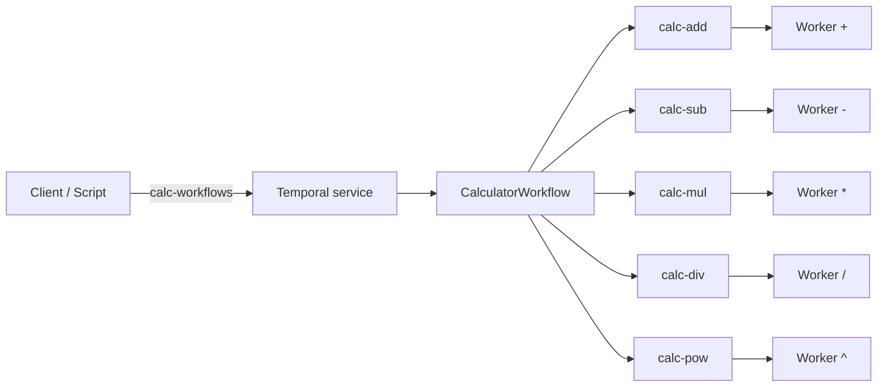

# Requirements: Architecture and Tradeoffs

**Type**: design / cross-cutting  
**Dependencies**: [requirements-project.md](./requirements-project.md)

## Context

The system has three concerns: a **reusable worker SDK**, a **reference calculator** that proves multi-queue orchestration, and **local Kubernetes** operations. Teams adopting the SDK must not be forced to rewrite workers when enabling health probes.

**Stack**: Python, Poetry, `temporalio`, **minikube** for local K8s. Canonical decisions: [requirements-decisions.md](./requirements-decisions.md).

**Specs layout:** [`specs/features/`](../features/) describe product behavior and link to **one** matching [`specs/tasks/*.tasks.md`](../tasks/) file each. **Atomic tasks, dependencies, and waves** live only under [`specs/tasks/`](../tasks/) ([priority-and-dependency-order.md](../tasks/priority-and-dependency-order.md)) to avoid duplicate or drifting task lists.

## Cross-cutting guardrails

These notes keep **specs**, **tasks** ([`specs/tasks/`](../tasks/)), and implementation aligned. Deeper conventions live under [`.cursor/rules/`](../../.cursor/rules/) and [`.cursor/skills/`](../../.cursor/skills/) (optional detail for agents).

**Boundaries (vs `.cursor/rules/architecture.mdc`):** MVP uses **layered** ownership (table below). **Workflow/activity payloads** are **`str` + `Decimal` rules** at the Temporal boundary—typed boundaries without a REST layer.

**Security (input, secrets, logs):** No `eval()` / shell with user expression; **Secrets** per [requirements-decisions.md](./requirements-decisions.md); **logging** without full raw payloads at INFO; wire payloads validated (`str` → `Decimal`), no pickle from tasks. AuthN/Z **out of MVP**; **localhost-first** port-forward default.

**Performance:** [requirements-decisions.md](./requirements-decisions.md) **Expression input limits** and **Metrics** / histogram rows bound cost; profile before micro-optimizing parser (`performance.mdc`); do not drop validation or change **Decimal** semantics for speed without updating decisions.

**Pre-deploy (local minikube, evaluator-ready):**

| Gate | Expectation |
|------|-------------|
| Tests | Unit suite green per README; Temporal integration **local** per decisions (CI optional). |
| App DB migrations | **None**; Postgres/Temporal via manifests. |
| Config / secrets | Documented env + **Secret** workflow; no cleartext credentials in Git. |
| Dependencies | `poetry.lock` when code exists; optional CVE audit per decisions. |
| Smoke | Probes Ready; trigger script succeeds; [feature-kubernetes-deployment.md](../features/feature-kubernetes-deployment.md) runbook. |

**DevOps deferrals (post-MVP / optional):** Mandatory Docker **HEALTHCHECK** (K8s probes are MVP primary), **Trivy/Snyk** on image in CI, full **trace_id** / OpenTelemetry, **RED/SLO** alerting—see [FUTURE.md](../FUTURE.md) unless adopted early in CI tasks.

**Planning:** [`.cursor/rules/planning.mdc`](../../.cursor/rules/planning.mdc); task order [priority-and-dependency-order.md](../tasks/priority-and-dependency-order.md).

## Decision: Layering

| Layer | Owns |
|-------|------|
| SDK core | Env-based bootstrap, worker lifecycle, graceful shutdown, optional metrics and health HTTP server (opt-in). |
| Domain (calculator) | Expression AST, precedence/associativity rules, orchestration logic in the workflow. |
| Temporal I/O | Workflow and activity definitions, task queue names, **retry and timeout policies** (defaults documented in README; align with [requirements-decisions.md](./requirements-decisions.md)). |

**Consequence**: Calculator code depends on the SDK; the SDK does not depend on calculator types.

## Decision: Expression size and cost

**Authoritative caps** (max characters after whitespace strip, max binary operators): [requirements-decisions.md](./requirements-decisions.md) (**Expression input limits**). They bound **Temporal history growth**, **activity count**, and tail **latency** (MVP uses **one activity per binary operation**). README or design doc should state that **throughput and duration scale with expression complexity** under the six-queue topology.

## Decision: Where parsing runs

**Chosen approach (default)**: Parse and build an AST **inside the workflow** using deterministic logic only.

- **Pros**: No nondeterminism from parsing in activities; single source of truth for structure; easier replay reasoning.
- **Cons**: Workflow code contains parsing; must keep it pure and well-tested.

**Alternative (document if rejected)**: Parse in a dedicated activity—requires fixed SDK version and careful determinism handling.

## Decision: Per-operator task queues

Each operator class (`+`, `-`, `*`, `/`, `^`) executes on a **different worker and task queue**. Parentheses are structural only (no separate “paren” queue).

**Consequence**: **Six** worker Deployments (or equivalent): **one** polls **`calc-workflows`** (workflows only) and **five** poll **`calc-add` … `calc-pow`** (one operator each)—see [api-workflow-activity-contracts.md](../features/api-workflow-activity-contracts.md) and [requirements-decisions.md](./requirements-decisions.md).

## Decision: Health probes without caller code changes

Enable liveness/readiness via **SDK configuration only** (e.g. environment variables and dependency upgrade), not new mandatory callsites in application code.

- **Implementation sketch**: Optional HTTP server started when bind address env is set; defaults keep server off.
- **Limitation**: Some configuration (bind address, port) is unavoidable for HTTP probes.

## Decision: Calculator semantics (resolved)

**Authoritative detail** (queues, unary rules, exponent rules, deploy topology): [requirements-decisions.md](./requirements-decisions.md). Summary only:

- **Precedence**: `^` above `* /` above `+ -` (unchanged from original `instructions`).
- **Associativity**: **Left-associative** at each level, **including `^`** → `a^b^c` = `(a^b)^c`.
- **Numeric type**: `decimal.Decimal` semantics; **final** quantize 2dp **`ROUND_UP`**; **`str`** on the wire between activities until then.

## Decision: Implementation language

**Python** with **Poetry** for packaging and dependency locking. Document versions (Python, `temporalio`) in README.

**YAGNI**: No polyglot workers until a stated requirement appears.

## Diagram (reference for design doc)

Maintain an equivalent diagram in README or `docs/design.md`:

Six workers total: **one** polls **`calc-workflows`** (runs `CalculatorWorkflow`) **plus** the **five** activity workers above (one queue each). The diagram emphasizes activity dispatch; the workflow worker is the entry point for the client.

## Acceptance criteria

- [x] README or design doc states parsing location and why.
- [x] README or design doc lists task queue naming convention and worker topology.
- [x] Probe strategy documented: how zero/new callsite adoption works and which env vars activate it.
- [x] Explicit statement of precedence and left-associativity (including `^`) matches [requirements-decisions.md](./requirements-decisions.md).
- [x] Explicit statement of `Decimal`, 2 decimal places, and `ROUND_UP` policy.
- [x] README documents **expression input limits** and **default workflow/activity timeouts and retries** (or points to a single table in-repo).
- [x] Design doc or **`docs/adr/`** captures the **“parse in workflow”** decision (context, decision, consequences) per `.cursor/rules/architecture.mdc` ADR guidance.
