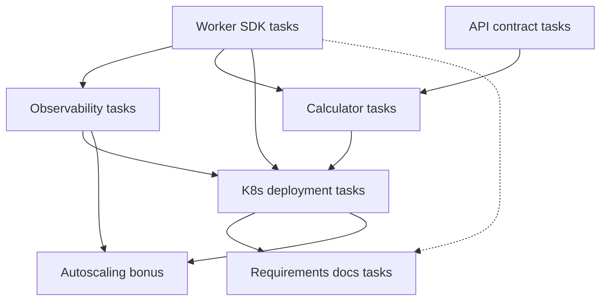

# Task files: priority and dependency order

**Sources**

- Feature specs: [`../features/`](../features/) — **behavior and contracts** only; each links to its `*.tasks.md` file (no duplicate task lists in feature specs).
- Locked decisions + architecture guardrails: [`../requirements/requirements-decisions.md`](../requirements/requirements-decisions.md), [`../requirements/requirements-architecture.md`](../requirements/requirements-architecture.md#cross-cutting-guardrails)
- Deliverables: [`../requirements/requirements-deliverables.md`](../requirements/requirements-deliverables.md)

**Single source of truth for tasks:** files in this directory (`specs/tasks/*.tasks.md`). If a feature spec and a task file disagree, **update the task file and requirements-decisions** (not the other way around).

Task breakdown follows [`.cursor/agents/product_manager.md`](../../.cursor/agents/product_manager.md) (atomic, testable, P0–P3) and [`.cursor/rules/planning.mdc`](../../.cursor/rules/planning.mdc).

## Priority tiers

| Tier | Task file | Rationale |
|------|-----------|-----------|
| P0 | [feature-worker-sdk.tasks.md](./feature-worker-sdk.tasks.md) | Foundation for workers and images. |
| P0 | [api-workflow-activity-contracts.tasks.md](./api-workflow-activity-contracts.tasks.md) | Boundary types, limits, queues; before calculator hardens. |
| P0 | [feature-observability-graceful-shutdown.tasks.md](./feature-observability-graceful-shutdown.tasks.md) | Probes and metrics for K8s and autoscaling prep. |
| P0 | [feature-distributed-calculator-workflow.tasks.md](./feature-distributed-calculator-workflow.tasks.md) | Core calculator behavior; needs WS + API types. |
| P0 | [feature-kubernetes-deployment.tasks.md](./feature-kubernetes-deployment.tasks.md) | MVP cluster path; needs worker image + probes. |
| P0 | [requirements-documentation.tasks.md](./requirements-documentation.tasks.md) | README/deliverables item 7, ADR/design, pre-deploy checklist. |
| P2 | [feature-autoscaling-bonus.tasks.md](./feature-autoscaling-bonus.tasks.md) | After P0; needs cluster + metrics. |

## Dependency graph (what blocks what)

**Notes**

- **D (requirements-documentation)** is gated on **K8-05** (see [requirements-documentation.tasks.md](./requirements-documentation.tasks.md)); **WS-07** can land in parallel (dotted: same “polish” phase).
- **Calculator before Kubernetes** on the graph means **application code + contracts** are ready **before** the **trigger script** and full stack are assumed green; **DC-06** integration may still run against a stack brought up by **K8-04+** (README-parity path).

## Suggested execution waves

| Wave | Task IDs (representative) | Focus |
|------|---------------------------|--------|
| **1** | WS-01…WS-05, API-01…API-03, API-05, DC-01…DC-02, **DOC-02** | Env, public API, contract types/errors, parser/limits, ADR from specs. |
| **2** | OB-01…OB-06, DC-03…DC-05 (+ DC-05a/b), API-04 | Shutdown, logs, metrics, health, workflow dispatch, registration tests. |
| **3** | K8-01…K8-06, DC-06, WS-07 | Image, manifests, deploy/trigger, integration test, CI baseline. |
| **4** | K8-07, DOC-01, DOC-03 | Runbook, README deliverables + skill alignment + pre-deploy checklist. |
| **5 (last)** | AS-01…AS-05 | Autoscaling bonus. |

## Per-feature / per-area task files (execution order)

| Order | File |
|------|------|
| 1 | [feature-worker-sdk.tasks.md](./feature-worker-sdk.tasks.md) |
| 2 | [api-workflow-activity-contracts.tasks.md](./api-workflow-activity-contracts.tasks.md) |
| 3 | [feature-observability-graceful-shutdown.tasks.md](./feature-observability-graceful-shutdown.tasks.md) |
| 4 | [feature-distributed-calculator-workflow.tasks.md](./feature-distributed-calculator-workflow.tasks.md) |
| 5 | [feature-kubernetes-deployment.tasks.md](./feature-kubernetes-deployment.tasks.md) |
| 6 | [requirements-documentation.tasks.md](./requirements-documentation.tasks.md) |
| 7 | [feature-autoscaling-bonus.tasks.md](./feature-autoscaling-bonus.tasks.md) |

## API contract vs calculator

The API spec **authors** the contract with **no upstream feature dependency**; **API-04** (registration matrix) lands **after** **DC-05** (or **DC-05a** routing proof). Calculator implementation remains **blocked** on **API-01** / **API-02** for shared types and queues.

## Spec ↔ task traceability

| Spec | Task file |
|------|-----------|
| [feature-worker-sdk.md](../features/feature-worker-sdk.md) | feature-worker-sdk.tasks.md |
| [api-workflow-activity-contracts.md](../features/api-workflow-activity-contracts.md) | api-workflow-activity-contracts.tasks.md |
| [feature-observability-graceful-shutdown.md](../features/feature-observability-graceful-shutdown.md) | feature-observability-graceful-shutdown.tasks.md |
| [feature-distributed-calculator-workflow.md](../features/feature-distributed-calculator-workflow.md) | feature-distributed-calculator-workflow.tasks.md |
| [feature-kubernetes-deployment.md](../features/feature-kubernetes-deployment.md) | feature-kubernetes-deployment.tasks.md |
| [feature-autoscaling-bonus.md](../features/feature-autoscaling-bonus.md) | feature-autoscaling-bonus.tasks.md |
| [requirements-deliverables.md](../requirements/requirements-deliverables.md), [requirements-architecture.md](../requirements/requirements-architecture.md) | requirements-documentation.tasks.md |
